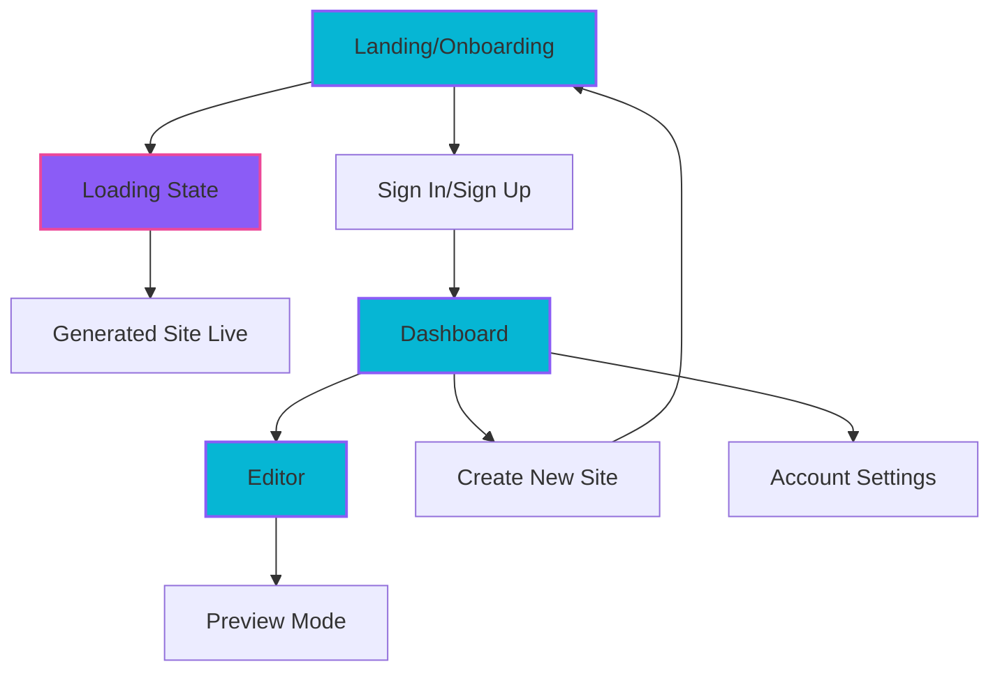
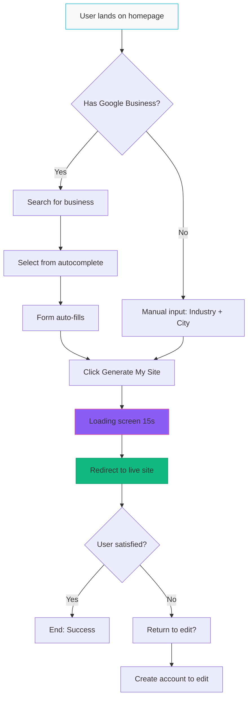
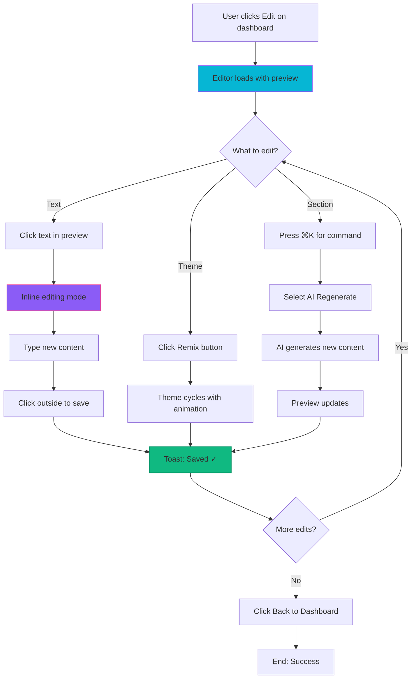
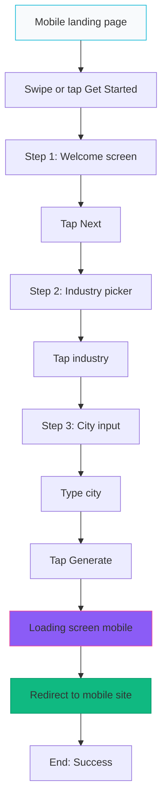

# QuickProSite UI/UX Specification

**Document Version:** 1.0
**Last Updated:** December 2, 2025
**Author:** UX Design Team
**Status:** Draft for Stakeholder Review

---

## 1. Introduction

This document defines the user experience goals, information architecture, user flows, and visual design specifications for QuickProSite's user interface. It serves as the foundation for visual design and frontend development, ensuring a cohesive and user-centered experience.

**Project Context:**
QuickProSite is an AI-powered website builder targeting busy service business professionals (plumbers, electricians, HVAC technicians, landscapers) who need a professional online presence but have zero time or technical skills to build one. The redesign transforms the MVP from a functional but clunky form-based interface into a "magical" AI-driven experience that rivals modern tools like Framer and Wix Studio.

### Change Log

| Date | Version | Description | Author |
|------|---------|-------------|--------|
| 2025-12-02 | 1.0 | Initial UX specification for redesign | UX Team |

---

## 2. Overall UX Goals & Principles

### 2.1 Target User Personas

**Primary Persona: "Busy Bruce" - The Overwhelmed Tradesperson**
- **Demographics:** 35-55 years old, owns a service business (5-25 employees)
- **Tech Savvy:** Low to medium; comfortable with smartphone apps but not web development
- **Pain Points:**
  - Works 50-70 hours/week, zero time for website management
  - Previous attempts at DIY websites were frustrating and abandoned
  - Hiring web designers is expensive ($2-5K) and takes weeks
- **Goals:**
  - Get online presence in under 5 minutes
  - Look professional to compete with larger companies
  - Get more calls and bookings from local customers
- **Quote:** *"I just need a website that looks good and gets me jobs. I don't have time to learn Wix."*

**Secondary Persona: "Marketing Mary" - The Business Manager**
- **Demographics:** 28-45 years old, manages marketing for small business or franchise
- **Tech Savvy:** Medium to high; uses Canva, social media management tools
- **Pain Points:**
  - Needs to launch websites quickly for multiple locations
  - Limited budget for custom development
  - Wants control over branding but not heavy editing work
- **Goals:**
  - Deploy multiple sites quickly (< 1 hour per site)
  - Maintain brand consistency across locations
  - Easy content updates without developer help
- **Quote:** *"I need to launch 10 sites this quarter. Show me the fastest way."*

### 2.2 Usability Goals

1. **Speed to Launch:** New users generate a complete, professional website in under 60 seconds from landing to live site.
2. **Zero Learning Curve:** Users never see a tooltip, help document, or tutorial. The interface is self-evident.
3. **Maximum 3 Interactions:** Users complete the entire onboarding process in 3 clicks/taps maximum (excluding typing).
4. **Instant Gratification:** Every action produces immediate, visible feedback (no "processing" dead-ends).
5. **Undo-Friendly:** All changes are reversible with clear undo/redo mechanisms.
6. **Mobile-First:** 60% of target users will access from mobile devices during work hours.

### 2.3 Design Principles

1. **Context Over Control**
   *Don't ask users what they want—infer from context and let them refine.*
   Instead of 20 form fields, we ask 2 questions and use AI to fill in the rest.

2. **Magic Over Mechanics**
   *The website should feel like it builds itself.*
   Hide the complexity. Show generative animations, progress indicators, and smooth transitions that create anticipation.

3. **Spotlight Focus (Anti-Clutter)**
   *If more than 3 items are visible, we've failed.*
   One primary action per screen. No sidebars competing for attention. Floating interfaces appear only when needed.

4. **Progressive Disclosure**
   *Show only what's needed, when it's needed.*
   Advanced features (custom code, SEO settings) are hidden until user explicitly requests them.

5. **Delight in the Details**
   *Micro-interactions separate good from great.*
   Buttons don't just click—they respond. Loading states don't just spin—they tell a story.

---

## 3. Information Architecture (IA)

### 3.1 Site Map



**Key Screens:**
1. **Landing/Onboarding** - Entry point for anonymous users
2. **Loading State** - Generative animation during site creation
3. **Generated Site** - User's live website (subdomain)
4. **Dashboard** - Hub for managing multiple sites (auth required)
5. **Editor** - Floating command interface for site editing (auth required)
6. **Sign In/Sign Up** - Clerk authentication pages

### 3.2 Navigation Structure

**Primary Navigation (Anonymous Users):**
- Landing page has no navigation—single focused CTA
- "Login to Dashboard →" link in top-right corner (subtle, ghost style)

**Primary Navigation (Authenticated Users - Dashboard):**
- Logo (top-left) → Returns to dashboard
- "+ Create New Site" (top-right) → Returns to onboarding
- Sign Out (top-right, secondary action)

**Primary Navigation (Authenticated Users - Editor):**
- "← Back" (top-left) → Returns to dashboard
- Site name (center-left) → Non-interactive, context indicator
- "View Live Site →" (top-right) → Opens live site in new tab
- "Save Changes" (top-right, primary action)

**Command Palette Navigation (Editor Only):**
- Triggered by: Floating Action Button (⚡) OR keyboard shortcut (⌘K / Ctrl+K)
- Provides quick access to all editor functions without cluttering UI

**Breadcrumb Strategy:**
- NOT USED - Violates "Anti-Clutter" principle
- Context is provided by header labels (e.g., "Editing: Joe's Plumbing")

---

## 4. User Flows

### 4.1 Flow: Anonymous User → Generated Website

**User Goal:** Launch a professional website in under 60 seconds without creating an account.

**Entry Points:**
- Direct navigation to homepage (www.quickprosite.com)
- Marketing campaign landing pages
- Referral links

**Success Criteria:**
- User sees live website at unique subdomain (e.g., joes.quickprosite.com)
- Website contains personalized content (business name, location, services)
- Total time from landing to live site: < 60 seconds

#### Flow Diagram



#### Edge Cases & Error Handling:

- **Google Search returns no results:**
  → Show "No results found" message + fallback to manual input (seamless transition)

- **API timeout during generation:**
  → Show error toast: "Taking longer than expected. We'll email you when ready." + Collect email inline

- **Invalid business name (profanity, trademark):**
  → Block generation, show message: "Business name not allowed. Please try another."

- **User clicks back during loading:**
  → Cancel generation (backend cleanup), return to form with data preserved

- **Subdomain already taken:**
  → Auto-append number (joes-plumbing-2) OR suggest alternative

**Notes:**
- Google Business integration is OPTIONAL but PROMINENT (reduce "Skip" language)
- Loading screen is NOT skippable (builds anticipation, prevents confusion)
- Generated site is PUBLICLY accessible (no auth required to view)

---

### 4.2 Flow: Dashboard User → Site Editor → Save Changes

**User Goal:** Make quick edits to existing website and see changes reflected live.

**Entry Points:**
- Dashboard "Edit" button on site card
- Direct link from email notification
- Live site "Edit This Site" link (if user is logged in)

**Success Criteria:**
- User makes content change (text edit, theme change, etc.)
- Changes auto-save within 2 seconds
- Live site reflects changes immediately (no manual publish step)

#### Flow Diagram



#### Edge Cases & Error Handling:

- **Network disconnection during edit:**
  → Show warning banner: "Changes not saved. Reconnecting..." + Queue changes locally + Retry on reconnect

- **User leaves page without clicking Save:**
  → Auto-save all changes (no explicit save required except for peace of mind)

- **AI regenerate fails (API error):**
  → Show error toast: "AI unavailable. Try again in a moment." + Keep existing content

- **Two users editing same site simultaneously:**
  → Last write wins + Show warning: "Another user is editing this site" (future: real-time collaboration)

- **Undo after accidental delete:**
  → Undo button (top-right) available for 30 seconds + Undo history (last 10 actions)

**Notes:**
- NO sidebar—all editing via inline interaction + command palette
- Changes are auto-saved but "Save Changes" button provides explicit control + shows saving state
- Preview is LIVE (not staged)—what you see is what's published

---

### 4.3 Flow: Mobile Onboarding (Touch-Optimized)

**User Goal:** Generate website on mobile device during work break.

**Entry Points:**
- Mobile browser landing page
- SMS/WhatsApp referral link
- Social media ad click

**Success Criteria:**
- Complete onboarding with thumb-only interaction
- No pinch-to-zoom required
- Total interactions: < 5 taps

#### Flow Diagram



#### Edge Cases & Error Handling:

- **User rotates device during onboarding:**
  → Maintain state, adjust layout (responsive)

- **Keyboard covers input field:**
  → Auto-scroll field into view above keyboard

- **User accidentally swipes back (browser gesture):**
  → Preserve form data, show "Continue where you left off"

**Notes:**
- Swipe gestures for multi-step flow (iOS/Android standard)
- Large tap targets (min 48px) for fat-finger friendliness
- Progress dots at top show "you're almost done" encouragement

---

## 5. Wireframes & Mockups

### 5.1 Design Files

**Primary Design Files:** [To be created in Figma]
**Wireframes:** See `02-wireframes.md` in this directory
**Mockup Prompts:** See `01-mockup-prompts.md` for AI generation instructions

### 5.2 Key Screen Layouts

#### Screen: Landing/Onboarding Page

**Purpose:** Capture user intent and generate website in < 60 seconds.

**Key Elements:**
- **Hero headline:** Large (72px), gradient text, emotionally compelling ("Your Site. Built by AI.")
- **Glassmorphic form card:** Dark, blurred background, elevated with shadow
- **Google Business Search:** Prominent, autocomplete-enabled, success state with green highlight
- **Mad Libs input:** Inline sentence format ("I'm a [dropdown] in [input]")
- **CTA button:** Full-width, gradient (cyan→purple), glowing shadow, large (64px height)

**Interaction Notes:**
- Google search shows dropdown on type (debounced 300ms)
- Manual inputs have glow border on focus (cyan → purple shift)
- Button disabled state during generation (spinner replaces text)
- Form errors inline (red text below field)

**Design File Reference:** [Figma: Landing Page Frame]

---

#### Screen: Loading/Generation State

**Purpose:** Build anticipation and explain what AI is doing.

**Key Elements:**
- **Animated central icon:** Sparkle/wand with pulse effect
- **Progress steps:** 5 steps listed vertically with icons, status indicators (✓ done, ⏳ pending, active pulse)
- **Progress bar:** Thin horizontal bar at bottom, gradient fill animates 0→100%
- **Time indicator:** Countdown text below bar ("~10 seconds remaining")

**Interaction Notes:**
- Steps appear sequentially with fade-up animation (stagger 2s)
- Active step has rotating gradient border (360° over 2s)
- Checkmark bounces in when complete (spring animation)
- No skip button—user must wait for "magic" moment

**Design File Reference:** [Figma: Loading State Frame]

---

#### Screen: Dashboard (Bento Grid)

**Purpose:** Central hub for managing multiple websites.

**Key Elements:**
- **Header:** Logo left, user email + sign-out right, backdrop blur, sticky
- **Page header:** "Your Sites" heading left, "+ Create New Site" gradient button right
- **Bento grid:** Asymmetric 12-column grid with variable card sizes
- **Site cards:** Glassmorphic, theme color strip, hover lift effect, Edit/View buttons
- **Empty state:** Dashed border, large + icon, motivational copy, CTA button

**Interaction Notes:**
- Cards fade in on load with 100ms stagger
- Hover card → translateY(-4px) + border glow
- Click Edit → navigate to editor
- Click View Live → new tab
- Empty state CTA → navigate to onboarding

**Design File Reference:** [Figma: Dashboard Frame]

---

#### Screen: Editor (Floating Command)

**Purpose:** Enable fast editing without sidebar clutter.

**Key Elements:**
- **Top header:** Back button, site name, View Live link, Save button
- **Full-screen preview:** Simulated browser chrome, live site rendering
- **Editable zones:** Dashed outline on hover, contentEditable on click
- **Floating Action Button (FAB):** Bottom-right, lightning bolt icon, gradient + glow
- **Remix button:** Bottom-left, gradient, "🎲 Remix Layout" text
- **Command palette:** Centered modal (triggered by FAB), search input, grouped commands

**Interaction Notes:**
- Click text → inline editing mode + floating toolbar (Bold, Italic, AI Rewrite, Undo)
- Blur text → auto-save + "✓ Saved" toast
- Click FAB → command palette slides up (spring animation)
- Click Remix → theme cycles with crossfade (0.5s)
- Press ⌘K → open command palette (keyboard shortcut)

**Design File Reference:** [Figma: Editor Frame]

---

## 6. Component Library / Design System

### 6.1 Design System Approach

**Decision:** Build custom design system optimized for dark mode AI aesthetic, inspired by modern tools (Linear, Vercel, Stripe).

**Rationale:**
- Existing systems (Material, Chakra) don't match "AI Product" vibe
- Full control over glassmorphism, gradients, and glow effects
- Lightweight (no bloat from unused components)

**Tooling:**
- Tailwind CSS for utility-first styling
- Radix UI for accessible primitives (Dialog, DropdownMenu, etc.)
- Framer Motion for animations
- CSS custom properties for theme tokens

---

### 6.2 Core Components

#### Component: Button

**Purpose:** Primary interactive element for CTAs and actions.

**Variants:**
1. **Primary (Gradient):** Cyan→Purple gradient, white text, glowing shadow
2. **Secondary (Ghost):** Border slate-700, text slate-300, hover bg-slate-800
3. **Danger:** Red background, white text, hover bg-red-500
4. **Icon (Circular):** Round w-12 h-12, icon centered, slate-800 background

**States:**
- **Default:** Base styling
- **Hover:** Scale 105%, brighter glow
- **Active:** Scale 98%
- **Disabled:** Opacity 50%, cursor-not-allowed
- **Loading:** Spinner replaces text, pulse animation

**Usage Guidelines:**
- Use Primary for main CTA (1 per screen max)
- Use Secondary for alternative actions
- Use Danger for destructive actions (delete, cancel)
- Never stack buttons vertically—always horizontal row

**Code Example:**
```tsx
<button className="bg-gradient-to-r from-cyan-500 to-purple-600 text-white px-6 py-3 rounded-xl font-bold shadow-lg shadow-purple-500/50 hover:scale-105 transition">
  Generate My Site ✨
</button>
```

---

#### Component: Input Field

**Purpose:** Text entry for forms and inline editing.

**Variants:**
1. **Default:** Slate-800 background, slate-700 border, rounded-lg
2. **With Icon:** Leading icon (search, email, etc.)
3. **Glow (Focus):** Cyan border, ring-2 ring-cyan-500/50
4. **Inline (Mad Libs):** No background, border-bottom only

**States:**
- **Default:** Slate colors
- **Focus:** Glow effect (cyan or purple)
- **Error:** Red border, red text below
- **Disabled:** Opacity 50%, cursor-not-allowed
- **Success:** Green border, checkmark icon

**Usage Guidelines:**
- Always include label (even if visually hidden for accessibility)
- Placeholder text should be examples, not instructions
- Error messages appear below input (not as tooltips)
- Focus state must be visible (3:1 contrast minimum)

---

#### Component: Card (Glassmorphic)

**Purpose:** Container for grouped content with depth.

**Variants:**
1. **Default:** bg-slate-900/50, backdrop-blur-lg, border slate-800/50
2. **Glow (Hover):** Border-purple-500/50, shadow-2xl shadow-purple-500/20
3. **Bento (Large):** Variable grid span, aspect ratio

**States:**
- **Default:** Subtle elevation
- **Hover:** Lift effect (-4px translateY), glow border
- **Active/Selected:** Persistent glow

**Usage Guidelines:**
- Use for site cards, settings panels, modals
- Never nest cards more than 2 levels deep
- Add theme accent strip for visual categorization
- Minimum padding: 24px (p-6)

---

#### Component: Modal/Dialog

**Purpose:** Focused content overlay for critical actions.

**Anatomy:**
- **Overlay:** bg-black/60, backdrop-blur-sm
- **Dialog box:** bg-slate-900, border slate-700, rounded-2xl, max-w-2xl
- **Close button:** X icon top-right, hover state
- **Content area:** Scrollable if needed

**States:**
- **Opening:** Slide up from bottom (spring animation)
- **Closing:** Fade out + slide down

**Usage Guidelines:**
- Use sparingly (violates "spotlight focus" if overused)
- Must be dismissible (ESC key + overlay click)
- Focus trap (keyboard nav stays within modal)
- Screen reader announces modal title

**Example:** Command Palette (see Editor wireframe)

---

#### Component: Toast Notification

**Purpose:** Non-blocking feedback for actions.

**Variants:**
1. **Success:** Green background, white text, checkmark icon
2. **Error:** Red background, white text, X icon
3. **Info:** Blue background, white text, info icon
4. **Loading:** Slate background, spinner

**Behavior:**
- Position: Fixed top-4 right-4
- Duration: 3 seconds (auto-dismiss)
- Stacking: Multiple toasts stack vertically
- Animation: Slide in from right, fade out

**Usage Guidelines:**
- Use for confirmations ("✓ Saved", "Site published")
- Use for non-critical errors ("Failed to save, retrying...")
- Do NOT use for critical errors (use modal instead)
- Max 1 toast visible at a time (queue if multiple)

---

## 7. Branding & Style Guide

### 7.1 Visual Identity

**Brand Guidelines:** [To be linked - QuickProSite Brand Book]

**Brand Personality:**
- **Innovative:** Cutting-edge AI technology
- **Friendly:** Approachable, not intimidating
- **Fast:** Speed is our superpower
- **Reliable:** Professional results, every time

---

### 7.2 Color Palette

| Color Type | Hex Code | Usage |
|-----------|----------|-------|
| **Background Primary** | `#0a0a0f` (slate-950) | Main app background |
| **Background Secondary** | `#1a1a24` (slate-900) | Cards, panels |
| **Background Tertiary** | `#2a2a3a` (slate-800) | Inputs, hover states |
| **Gradient Primary** | `#06b6d4 → #8b5cf6` (Cyan → Purple) | CTA buttons, links |
| **Gradient Glow** | `#8b5cf6 → #ec4899` (Purple → Pink) | Accent elements, Remix button |
| **Text Primary** | `#f8fafc` (slate-50) | Headings, body text |
| **Text Secondary** | `#94a3b8` (slate-400) | Subheadings, labels |
| **Text Tertiary** | `#64748b` (slate-500) | Hints, timestamps |
| **Success** | `#10b981` (emerald-500) | Positive feedback, confirmations |
| **Warning** | `#f59e0b` (amber-500) | Cautions, important notices |
| **Error** | `#ef4444` (red-500) | Errors, destructive actions |
| **Border Subtle** | `rgba(148,163,184,0.1)` | Default borders |
| **Border Glow** | `rgba(139,92,246,0.3)` | Focus states, accents |

**Color Accessibility:**
- All text meets WCAG AA contrast (4.5:1 for body, 3:1 for large text)
- Error states use icon + color (not color alone)
- Focus indicators use border + shadow (not color alone)

---

### 7.3 Typography

#### Font Families

- **Primary:** Geist Sans (Inter fallback)
- **Secondary:** (Same as primary)
- **Monospace:** Geist Mono (JetBrains Mono fallback)

**Rationale:** Geist is modern, highly legible, and optimized for screens. Open-source alternative to San Francisco/Segoe UI.

#### Type Scale

| Element | Size | Weight | Line Height | Usage |
|---------|------|--------|-------------|-------|
| **H1** | 72px (text-7xl) | 700 (Bold) | 1.1 | Landing headline only |
| **H2** | 48px (text-5xl) | 700 (Bold) | 1.2 | Page titles |
| **H3** | 36px (text-4xl) | 600 (Semibold) | 1.3 | Section headings |
| **H4** | 24px (text-2xl) | 600 (Semibold) | 1.4 | Subsection headings |
| **Body** | 16px (text-base) | 400 (Regular) | 1.5 | Paragraphs, UI text |
| **Small** | 14px (text-sm) | 400 (Regular) | 1.4 | Labels, captions |
| **Tiny** | 12px (text-xs) | 400 (Regular) | 1.3 | Timestamps, metadata |

**Text Rendering:**
- `-webkit-font-smoothing: antialiased` for macOS/iOS
- `text-rendering: optimizeLegibility` for better kerning

---

### 7.4 Iconography

**Icon Library:** Heroicons 2.0 (outline style) + Custom SVGs for brand icons

**Style:** 24px stroke width, rounded line caps, consistent optical size

**Usage Guidelines:**
- Use outline style (not solid) for consistency with glassmorphism
- Icons always paired with text (except icon-only buttons with aria-label)
- Icon color inherits from text color (currentColor)
- Animated icons use subtle scale/rotate (not bounce)

**Custom Icons:**
- Sparkle/Wand for AI features (custom SVG)
- Lightning bolt for command palette (Heroicons: BoltIcon)
- Remix/Dice for theme cycling (custom SVG)

---

### 7.5 Spacing & Layout

**Grid System:** 12-column CSS Grid (standard but with bento variations)

**Breakpoints:**
- Mobile: 0-639px
- Tablet: 640px-1023px
- Desktop: 1024px-1279px
- Wide: 1280px+

**Spacing Scale:** (Tailwind default scale)
```
1 unit  = 4px   (p-1)
2 units = 8px   (p-2)
4 units = 16px  (p-4)  ← Base spacing
6 units = 24px  (p-6)
8 units = 32px  (p-8)
12 units = 48px (p-12)
16 units = 64px (p-16)
```

**Max Widths:**
- Content containers: 1280px (max-w-7xl)
- Text content: 672px (max-w-prose or max-w-2xl)
- Modals: 640px (max-w-2xl) or 448px (max-w-md)

---

## 8. Accessibility Requirements

### 8.1 Compliance Target

**Standard:** WCAG 2.1 Level AA (with select AAA enhancements)

**Rationale:** Level AA is industry standard and legally required in many jurisdictions. AAA is aspirational for key interactions.

---

### 8.2 Key Requirements

**Visual:**
- **Color contrast ratios:**
  - Body text: 4.5:1 minimum (AA)
  - Large text (24px+): 3:1 minimum (AA)
  - UI components: 3:1 minimum (AA)
- **Focus indicators:**
  - 2px solid border + 4px shadow (cyan or purple)
  - Visible on all interactive elements
  - 3:1 contrast with background
- **Text sizing:**
  - Base font: 16px (prevents zoom on iOS)
  - User can zoom to 200% without loss of content

**Interaction:**
- **Keyboard navigation:**
  - All interactive elements focusable via Tab
  - Logical focus order (left-to-right, top-to-bottom)
  - Modal traps focus until dismissed (Shift+Tab reverses)
  - Shortcuts: ⌘K (command palette), ESC (close modal), Enter (submit form)
- **Screen reader support:**
  - All images have alt text (or role="presentation" if decorative)
  - Form inputs have associated labels (aria-label or <label>)
  - Live regions announce changes (aria-live="polite" for toasts)
  - Headings use proper hierarchy (h1 → h2 → h3, no skipping)
- **Touch targets:**
  - Minimum 44x44px (Apple guidelines)
  - Spacing: 8px minimum between targets

**Content:**
- **Alternative text:**
  - All images: Descriptive alt text (not "image" or filename)
  - Icons with meaning: aria-label (e.g., "Close dialog")
  - Decorative images: alt="" or aria-hidden="true"
- **Heading structure:**
  - One h1 per page (page title)
  - Headings nest logically (h1 → h2 → h3, no skipping levels)
  - Screen readers can navigate by headings
- **Form labels:**
  - Every input has visible or aria-label
  - Error messages linked with aria-describedby
  - Required fields marked with aria-required="true" + visual indicator

---

### 8.3 Testing Strategy

**Automated Testing:**
- Run axe-core or Lighthouse on every screen (CI/CD integration)
- Fix all critical and serious issues before merge

**Manual Testing:**
- Test with keyboard only (unplug mouse)
- Test with VoiceOver (macOS) or NVDA (Windows)
- Test at 200% zoom (Chrome DevTools)
- Test with high contrast mode (Windows)

**User Testing:**
- Recruit 2-3 users with disabilities (screen reader users, motor impairments)
- Conduct moderated usability tests on key flows
- Iterate based on feedback

---

## 9. Responsiveness Strategy

### 9.1 Breakpoints

| Breakpoint | Min Width | Max Width | Target Devices | Layout Changes |
|-----------|-----------|-----------|----------------|----------------|
| **Mobile** | 0px | 639px | iPhone SE, Galaxy S | Single column, stacked elements, bottom nav |
| **Tablet** | 640px | 1023px | iPad, Android tablets | 2-column grid, sidebar collapses to drawer |
| **Desktop** | 1024px | 1279px | Laptops (13"-15") | 12-column grid, full sidebar visible |
| **Wide** | 1280px | - | Large monitors (27"+) | Max-width containers, more whitespace |

---

### 9.2 Adaptation Patterns

**Layout Changes:**
- **Mobile:** Single column, cards full-width, no bento grid (just stack)
- **Tablet:** 2-column bento grid (col-span-6 max), sidebar becomes drawer
- **Desktop:** Full 12-column bento grid, sidebar always visible
- **Wide:** Content centered with max-width, don't stretch to fill

**Navigation Changes:**
- **Mobile:** Header collapses to hamburger menu (if needed), bottom CTA sticky
- **Tablet:** Header shows all links but smaller font
- **Desktop:** Full header with all links + user avatar

**Content Priority:**
- **Mobile:** Hide secondary content (timestamps, "Created X days ago"), show on hover/tap
- **Tablet:** Show most content, hide only tertiary info
- **Desktop:** Show all content

**Interaction Changes:**
- **Mobile:** Swipe gestures for multi-step forms, tap-and-hold for contextual actions
- **Desktop:** Hover states, keyboard shortcuts, right-click menus

---

## 10. Animation & Micro-interactions

### 10.1 Motion Principles

1. **Purposeful, Not Decorative:** Every animation serves a function (provide feedback, guide attention, show relationships).
2. **Fast and Subtle:** Animations should be quick (150-300ms) to avoid feeling sluggish.
3. **Respect Reduced Motion:** Honor `prefers-reduced-motion: reduce` by disabling non-essential animations.
4. **Consistent Easing:** Use natural easing curves (ease-out for entrances, ease-in for exits, ease-in-out for transitions).

**Easing Functions:**
- **Default:** `transition-all duration-300 ease-in-out` (Tailwind default)
- **Entrances:** `transition duration-200 ease-out` (fade in, slide up)
- **Exits:** `transition duration-150 ease-in` (fade out, slide down)
- **Spring (Framer Motion):** `spring: { type: "spring", stiffness: 300, damping: 30 }`

---

### 10.2 Key Animations

1. **Button Hover:**
   Description: Scale up and brighten glow
   Duration: 200ms
   Easing: ease-out
   Code: `hover:scale-105 transition-transform`

2. **Card Hover (Dashboard):**
   Description: Lift up and add border glow
   Duration: 200ms
   Easing: ease-out
   Code: `hover:-translate-y-1 hover:border-purple-500/50 transition-all`

3. **Toast Notification Enter:**
   Description: Slide in from right
   Duration: 300ms
   Easing: ease-out
   Code: Framer Motion `initial={{ x: 100, opacity: 0 }} animate={{ x: 0, opacity: 1 }}`

4. **Command Palette Open:**
   Description: Slide up from bottom with spring
   Duration: 400ms
   Easing: Spring (stiffness 300, damping 30)
   Code: Framer Motion `initial={{ y: 100, opacity: 0 }} animate={{ y: 0, opacity: 1 }} transition={{ type: "spring" }}`

5. **Loading Progress Steps:**
   Description: Fade up with stagger
   Duration: 200ms per step
   Easing: ease-out
   Code: Framer Motion `variants` with stagger delay

6. **Theme Cycle (Remix):**
   Description: Crossfade between themes
   Duration: 500ms
   Easing: ease-in-out
   Code: Framer Motion `AnimatePresence` with `mode="wait"`

7. **Inline Edit Toolbar Appear:**
   Description: Fade in above text
   Duration: 150ms
   Easing: ease-out
   Code: `opacity-0 → opacity-100 transition-opacity`

8. **Glow Pulse (Loading Icon):**
   Description: Shadow expands and contracts
   Duration: 2s infinite
   Easing: ease-in-out
   Code: `@keyframes glowPulse` with `shadow-2xl → shadow-3xl`

9. **Save Confirmation Toast:**
   Description: Slide down from top
   Duration: 300ms
   Easing: ease-out
   Code: Framer Motion `initial={{ y: -100 }} animate={{ y: 0 }}`

10. **Skeleton Loader:**
    Description: Animated gradient shimmer
    Duration: 1.5s infinite
    Easing: linear
    Code: `@keyframes shimmer` with gradient position animation

---

## 11. Performance Considerations

### 11.1 Performance Goals

- **Page Load (FCP):** < 1.5 seconds on 4G (Lighthouse: 90+ score)
- **Interaction Response (FID):** < 100ms (button click → visual feedback)
- **Animation FPS:** 60fps minimum (no jank during transitions)

---

### 11.2 Design Strategies

**Image Optimization:**
- Use Next.js `<Image>` component (lazy loading, srcset, WebP)
- Hero images: max 200KB, WebP format
- Thumbnails: max 50KB
- Avoid images where SVG/CSS can achieve same effect

**Animation Performance:**
- Animate only `transform` and `opacity` (GPU-accelerated)
- Avoid animating `width`, `height`, `margin` (causes reflow)
- Use `will-change: transform` sparingly (only during animation)

**Code Splitting:**
- Lazy load editor page (not needed on landing)
- Lazy load command palette (not needed until ⌘K pressed)
- Use dynamic imports for heavy libraries (Framer Motion, Radix components)

**Glassmorphism Performance:**
- Limit `backdrop-filter: blur()` to < 5 instances per screen (expensive)
- Use static blur images as fallback on low-end devices
- Test on mid-range Android devices (not just MacBook Pro)

**Loading States:**
- Show skeleton loaders immediately (< 100ms)
- Use optimistic UI updates (assume success, rollback on error)
- Prefetch dashboard data on landing page (if user likely to log in)

---

## 12. Next Steps

### 12.1 Immediate Actions

1. **Stakeholder Review:** Present this spec + wireframes + mockup prompts to founders for approval
2. **Generate High-Fi Mockups:** Use prompts in `01-mockup-prompts.md` with v0.dev/Lovable to create visual comps
3. **Component Library Build:** Start with foundational components (Button, Input, Card) using `04-component-library.md` spec
4. **Implementation Planning:** Use `05-implementation-checklist.md` to break work into sprints
5. **Accessibility Audit:** Run axe-core on current MVP to establish baseline

### 12.2 Design Handoff Checklist

- [x] All user flows documented (3 key flows complete)
- [x] Component inventory complete (5 core components defined)
- [x] Accessibility requirements defined (WCAG AA target)
- [x] Responsive strategy clear (4 breakpoints defined)
- [x] Brand guidelines incorporated (color, typography, spacing)
- [x] Performance goals established (FCP < 1.5s, FID < 100ms)
- [ ] High-fidelity mockups created (pending v0 generation)
- [ ] Component library built (pending implementation)
- [ ] User testing conducted (pending prototype)

---

## 13. Appendix

### 13.1 Glossary

- **Bento Grid:** Asymmetric grid layout (like Japanese bento boxes) where items span variable columns/rows
- **Glassmorphism:** Design style using frosted glass effect (backdrop blur + transparency)
- **Mad Libs:** Inline sentence format with fill-in-the-blank inputs (e.g., "I'm a [plumber] in [Austin]")
- **Floating Command:** Modal interface that appears on-demand (like Spotlight/⌘K) instead of persistent sidebar
- **FAB (Floating Action Button):** Circular button that floats above content (Material Design pattern)

### 13.2 References

- **Dribbble Inspiration:** [Reference 1 - Motion], [Reference 2 - Dark UI]
- **Competitor Research:** Framer, Wix Studio, Webflow, Vercel
- **Design Systems Studied:** Linear, Stripe Dashboard, Vercel Dashboard
- **Accessibility:** WCAG 2.1 Guidelines (https://www.w3.org/WAI/WCAG21/quickref/)

---

**Document Status:** ✅ Complete - Ready for Stakeholder Review
**Next Document:** `04-component-library.md` (Component specifications for development)
